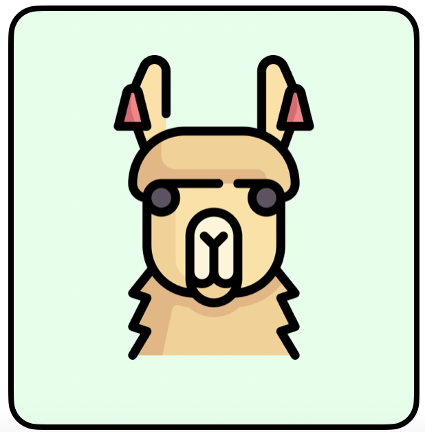
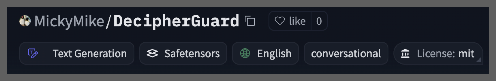

# DecipherGuard (Replication Package)


<!-- LOGO -->
<br />
<p align="center">
    
  </a>
  <h3 align="center">DecipherGuard</h3>
  <p align="center">
    A LoRa-tuned deciphering runtime safety guardrail for LLM-powered software applications.
  </p>
</p>

<p align="center">
    <h3 align="center"> 🚀 DecipherGuard is Available in <a href="https://huggingface.co/MickyMike/DecipherGuard">Huggingface Model Hub</a> 🚀 </h3>
    
</p>


#### Load the model with a single line of code 💨
```
AutoTokenizer.from_pretrained("MickyMike/DecipherGuard")
AutoModelForCausalLM.from_pretrained("MickyMike/DecipherGuard")
```

<!-- Table of contents -->
<details open="open">
  <summary>Table of Contents</summary>
  <ol>
    <li>
      <a href="#how-to-replicate">How to replicate</a>
        <ul>
          <li><a href="#environment-setup">Environment Setup</a></li>
          <li><a href="#datasets">Datasets</a></li>
          <li><a href="#models">Models</a></li>
          <li><a href="#experiment-replication">Experiment Replication</a></li>
        </ul>
    </li>
    <li>
      <a href="#appendix">Appendix</a>
    </li>
    <li>
      <a href="#acknowledgements">Acknowledgements</a>
    </li>
    <li>
      <a href="#citation">Citation</a>
    </li>
  </ol>
</details>

## How to Replicate

### Environment Setup
First of all, clone this repository to your local machine and access the main dir via the following command:
```
git clone https://github.com/awsm-research/DecipherGuard.git
cd DecipherGuard
```

Then, install the python dependencies via the following command:
```
pip install -r requirements.txt
```
### Datasets
This repo uses the following datasets:
- [CategoricalHarmfulQA](https://huggingface.co/datasets/declare-lab/CategoricalHarmfulQA)
- [do-not-answer](https://huggingface.co/datasets/LibrAI/do-not-answer)
- [AdvBench](https://huggingface.co/datasets/walledai/AdvBench)
- [forbidden_question](https://github.com/verazuo/jailbreak_llms/tree/main/data/forbidden_question)
- [alpaca](https://github.com/vinid/safety-tuned-llamas/blob/main/data/training/alpaca_small.json)

The datasets have been compiled, transformed by jailbreak attack functions, split into 80% testing and 1-10\% training, and stored at /data/split_attack_prompts

### Models
To replicate the experiment results, the following models are used:

- [DecipherGuard](https://huggingface.co/MickyMike/decipher_lora_5-2)
- [Llama-Guard-3-8B](https://huggingface.co/meta-llama/Llama-Guard-3-8B)
- [OpenAI Moderation (omni-moderation-latest)](https://platform.openai.com/docs/guides/moderation/overview?lang=curl)
- [PerspectiveAPI (v1alpha1)](https://developers.perspectiveapi.com/s/?language=en_US)
- [Perplexity (GPT2)](https://huggingface.co/openai-community/gpt2)

The models used can either be accessed from their huggingface pages, or as public, free APIs.

### Experiment Replication
To replicate the empirical results of the experiment, please use the run the following commands to get the prediction of each model:
```
cd DecipherGuard
python -m evaluate.evaluation_decipherguard
python -m evaluation.evaluation_llamaguard
python -m evaluation.evaluation_openai_moderation
python -m evaluation.evaluation_perspectiveAPI
python -m evaluation.evaluation_perplexity
```
We recommend to use **GPU with 16 GB up memory** for inferencing since **LlamaGuard is quite computational intensive**. 

### How to replicate RQ1
To reproduce the RQ1 result, run the following commands (Inference only):
```
cd DecipherGuard
python -m evaluation.evaluation_llamaguard
python -m evaluation.evaluation_openai_moderation
python -m evaluation.evaluation_perspectiveAPI
python -m evaluation.evaluation_perplexity
```
### How to replicate RQ2 & RQ3
To reproduce the RQ2&3 result, run the following commands (Inference only):
```
cd DecipherGuard
python -m evaluation.evaluation_decipherguard
```
To retrain the DecipherGuard model, run the following commands (Training + Inference):
```
cd DecipherGuard/train
python lora_decipher_main.py \
    --training_proportion=ENTER YOUR VALUE HERE (e.g., 1, 3, 5, 7, 10) \
    --do_train \
    --batch_size=1 \
    --data_dir=data \
    --model_name_or_path=meta-llama/Llama-Guard-3-8B \
    --saved_model_name=decipherguard \
    --learning_rate=1e-4 \
    --epochs=1 \
    --max_grad_norm=1.0 \
    --lora_r=8 \
    --lora_alpha=32 \
    --lora_dropout=0.1 \
    --max_train_input_length=2048 \
    --max_new_tokens=100 \
    --seed 123456  2>&1 | tee decipher_lora.log
```

### How to replicate RQ4
To reproduce the RQ4 result, run the following commands (Inference only):
```
cd DecipherGuard
python -m evaluation.evaluation_decipher_only
```

### How to replicate the ablation study in the discussion section
```
cd DecipherGuard
python -m lora.lora_testing_loop
```
This will produce the LoRa model results in in discussion section, specifically for the 6 different % of the training data used (1%,3%,5%,7%,10%,20%)

## Appendix

<div align="center">

<h3>
    <b>
            Results of RQ1 (Evaluate Existing SOTA Runtime Guardrails)
    </b>
</h3>

|      Model       |  Defence Success Rate (DSR) w/o jailbreak | Defence Success Rate (DSR) w/ jailbreak | 
|:----------------:|:------------------:|:----------------:|
|    **LlamaGuard**    |        **0.81**        |    **0.57**          | 
|OpenAI Moderation |        0.76        |    0.39          | 
| PerspectiveAPI   |        0.03        |    0.15          |
|     Perplexity   |        0.15        |    0.28          | 


<h3>
    <b>
            Results of RQ2 (Compare Defence Capability of our DecipherGuard with SOTA Runtime Guardrails)
    </b>
</h3>

|      Model       |   Defence Success Rate (DSR) w/ jailbreak | 
|:----------------:|:------------------:|
|  **DecipherGuard**   |      **0.94**          |
|    LlamaGuard    |      0.57          | 
|OpenAI Moderation |      0.39          | 
|     Perplexity   |      0.28          | 


<h3>
    <b>
            Results of RQ3 (Compare Overall Performance of our DecipherGuard with SOTA Runtime Guardrails)
    </b>
</h3>

|      Model       |   Overall Guardrail Performance (OGP) w/ jailbreak | 
|:----------------:|:------------------:|
|  **DecipherGuard**   |      **0.96**          |
|    LlamaGuard    |      0.75          | 
|OpenAI Moderation |      0.62          | 
|     Perplexity   |      0.45          | 

<h3>
    <b>
            Results of RQ4 (Ablation Study of our DecipherGuard)
    </b>
</h3>

|      Model       |   Overall Guardrail Performance (OGP) w/ jailbreak | Defence Success Rate (DSR) w/ jailbreak | 
|:----------------:|:------------------:|:------------------:|
|  **DecipherGuard**   |      **0.96**          |      **0.94**        |
|LoRa + LLamaGuard |      0.95       |     0.92         |
|Decipher + LlamaGuard|      0.67          |      0.76        |
|   LlamaGuard     |      0.75          |     0.57         |

</div> 

## Acknowledgements
We would like to express our gratitude to the author of [LlamaGuard](https://arxiv.org/abs/2312.06674) for their foundational work and inspiration, as well as the creators of the datasets used in this repository: [CategoricalHarmfulQA](https://huggingface.co/datasets/declare-lab/CategoricalHarmfulQA), [do-not-answer](https://huggingface.co/datasets/LibrAI/do-not-answer), [AdvBench](https://huggingface.co/datasets/walledai/AdvBench), [forbidden_question](https://github.com/verazuo/jailbreak_llms/tree/main/data/forbidden_question), and [alpaca](https://github.com/vinid/safety-tuned-llamas/blob/main/data/training/alpaca_small.json). Their efforts in curating and maintaining these resources were invaluable to this research.

## Citation
```
Under Review at IEEE TR
```
